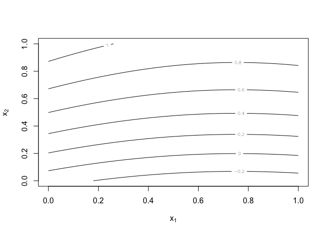
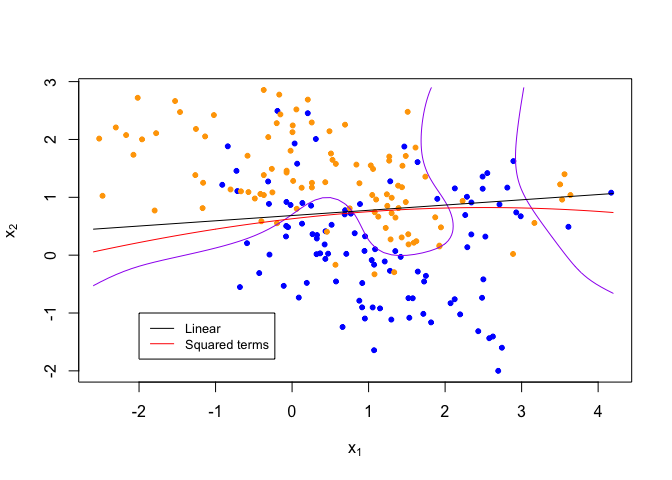

Homework 1
================
Marisa Blackman
January 15, 2023

# Code from mixture-data-li-knn.R with edits for assignment

## Data

``` r
library('class')
library('dplyr')
```

    ## Warning: package 'dplyr' was built under R version 4.0.5

    ## 
    ## Attaching package: 'dplyr'

    ## The following objects are masked from 'package:stats':
    ## 
    ##     filter, lag

    ## The following objects are masked from 'package:base':
    ## 
    ##     intersect, setdiff, setequal, union

``` r
## load binary classification example data from author website 
## 'ElemStatLearn' package no longer available
load(url('https://web.stanford.edu/~hastie/ElemStatLearn/datasets/ESL.mixture.rda'))
dat <- ESL.mixture

plot_mix_data <- function(dat, datboot=NULL) {
  if(!is.null(datboot)) {
    dat$x <- datboot$x
    dat$y <- datboot$y
  }
  plot(dat$x[,1], dat$x[,2],
       col=ifelse(dat$y==0, 'blue', 'orange'),
       pch=20,
       xlab=expression(x[1]),
       ylab=expression(x[2]))
  ## draw Bayes (True) classification boundary
  prob <- matrix(dat$prob, length(dat$px1), length(dat$px2))
  cont <- contourLines(dat$px1, dat$px2, prob, levels=0.5)
  rslt <- sapply(cont, lines, col='purple')
}

plot_mix_data(dat)
```

<!-- -->

## Linear Classifier with lm and predict functions

``` r
## fit linear classifier
fit_lc <- function(y, x1, x2, data) {lm(y ~ x1 + x2, data = data)}

## make predictions from linear classifier
predict_lc <- function(fit, newx) {predict(fit, newx)}

## fit model to mixture data and make predictions #on grid of values
lc_lm <- fit_lc(dat$y, dat$x[,1], dat$x[,2], data.frame(dat$y, dat$x)) 
lc_pred <- predict_lc(lc_lm, dat$xnew)  

## reshape predictions as a matrix
lc_pred <- matrix(lc_pred, length(dat$px1), length(dat$px2))
contour(lc_pred,
        xlab=expression(x[1]),
        ylab=expression(x[2]))
```

<!-- -->

``` r
## find the contours in 2D space such that lc_pred == 0.5
lc_cont <- contourLines(dat$px1, dat$px2, lc_pred, levels=0.5)

## plot data and decision surface
plot_mix_data(dat)
sapply(lc_cont, lines)
```

<!-- -->

    ## [[1]]
    ## NULL

## Linear classifier with squared terms

``` r
## fit linear classifier
fit_lc <- function(y, x1, x2, data) {lm(y ~ x1 + x2 + I(x1^2) + I(x2^2), data = data)}

## make predictions from linear classifier
predict_lc <- function(fit, newx) {predict(fit, newx)}

## fit model to mixture data and make predictions #on grid of values
lc_lm <- fit_lc(dat$y, dat$x[,1], dat$x[,2], data.frame(dat$y, dat$x)) 
lc_pred <- predict_lc(lc_lm, dat$xnew)  

## reshape predictions as a matrix
lc_pred <- matrix(lc_pred, length(dat$px1), length(dat$px2))
contour(lc_pred,
        xlab=expression(x[1]),
        ylab=expression(x[2]))
```

<!-- -->

``` r
## find the contours in 2D space such that lc_pred == 0.5
lc_cont_squared <- contourLines(dat$px1, dat$px2, lc_pred, levels=0.5)

## plot data and decision surface
plot_mix_data(dat)
sapply(lc_cont, lines, col = "black")
```

    ## [[1]]
    ## NULL

``` r
sapply(lc_cont_squared, lines, col = "red")
```

    ## [[1]]
    ## NULL

``` r
legend(-2, -1, legend=c("Linear", "Squared terms"),
       col=c("black", "red"), lty=1, cex=0.8)
```

<!-- -->

## Describe how this more flexible model affects the bias-variance tradeoff

Based on the above graph, the more flexible model would have less bias
since it can better approximate the true classification boundary. This
also increases the variance.
