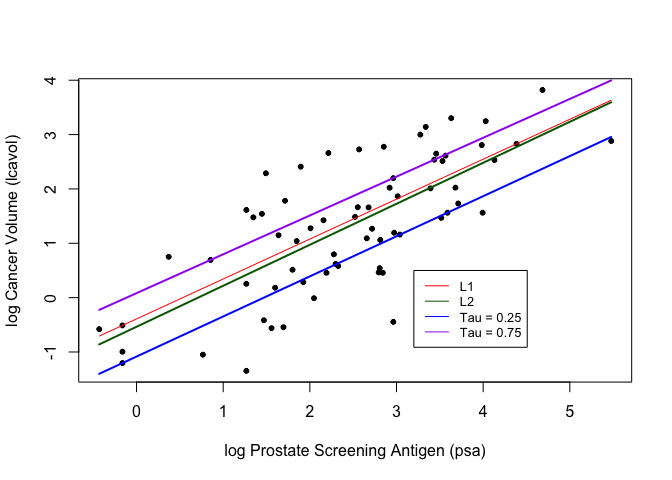
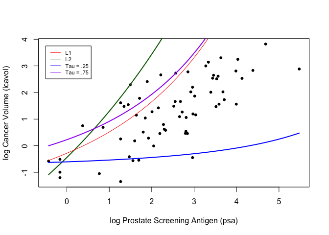

Homework 2
================
Marisa Blackman
1/19/2023

``` r
library(qrnn)

## load prostate data
prostate <- 
  read.table(url(
    'https://web.stanford.edu/~hastie/ElemStatLearn/datasets/prostate.data'))

## subset to training examples
prostate_train <- subset(prostate, train==TRUE)

## plot lcavol vs lpsa
plot_psa_data <- function(dat=prostate_train) {
  plot(dat$lpsa, dat$lcavol,
       xlab="log Prostate Screening Antigen (psa)",
       ylab="log Cancer Volume (lcavol)",
       pch = 20)
}
plot_psa_data()
```

<!-- -->

# Write functions that implement the L1 loss and tilted absolute loss functions.

``` r
L1_loss <- function(y, yhat){abs(y - yhat)}
tilted_loss_25 <- function(y, yhat) {tilted.abs(y-yhat, tau = .25)}
tilted_loss_75 <- function(y, yhat) {tilted.abs(y-yhat, tau = .75)}
```

# Create a figure that shows lpsa (x-axis) versus lcavol (y-axis). Add and label the linear model predictors associated with L2 loss, L1 loss, and tilted absolute value loss for tau = 0.25 and 0.75.

``` r
L2_loss <- function(y, yhat){(y-yhat)^2}

## fit simple linear model using numerical optimization
fit_lin <- function(y, x, loss=L2_loss, beta_init = c(-0.51, 0.75)) {
  err <- function(beta)
    mean(loss(y,  beta[1] + beta[2]*x)) #function to optimaize and initial values
  beta <- optim(par = beta_init, fn = err) #returns optimized parameters- this is beta hat
  return(beta)
}

## make predictions from linear model
predict_lin <- function(x, beta) {beta[1] + beta[2]*x}

## fit linear model
lin_beta_l2 <- fit_lin(y=prostate_train$lcavol, x=prostate_train$lpsa, loss=L2_loss)

## compute predictions for a grid of inputs
x_grid <- seq(min(prostate_train$lpsa), max(prostate_train$lpsa), length.out=100)
lin_pred_l2 <- predict_lin(x=x_grid, beta=lin_beta_l2$par)

## plot data
plot_psa_data()
lines(x=x_grid, y=lin_pred_l2, col='darkgreen', lwd=2)

## plot predictions 25
lin_beta_25 <- fit_lin(y=prostate_train$lcavol,
                           x=prostate_train$lpsa,
                           loss=tilted_loss_25)
lin_pred_25 <- predict_lin(x=x_grid, beta=lin_beta_25$par)
lines(x=x_grid, y=lin_pred_25, col='blue', lwd=2)

## plot predictions 75
lin_beta_75 <- fit_lin(y=prostate_train$lcavol,
                           x=prostate_train$lpsa,
                           loss=tilted_loss_75)
lin_pred_75 <- predict_lin(x=x_grid, beta=lin_beta_75$par)
lines(x=x_grid, y=lin_pred_75, col='purple', lwd=2)

## plot predictions l1
lin_beta_l1 <- fit_lin(y=prostate_train$lcavol,
                           x=prostate_train$lpsa,
                           loss=L1_loss)
lin_pred_l1 <- predict_lin(x=x_grid, beta=lin_beta_l1$par)
lines(x=x_grid, y=lin_pred_l1, col='red', lwd=1)
legend(3.2, .5, legend=c("L1", "L2", "Tau = 0.25", "Tau = 0.75"),
       col=c("red", "darkgreen", "blue", "purple"), lty=1, cex=0.8)
```

<!-- -->

# Write functions to fit and predict from a simple nonlinear model with three parameters defined by ‘beta\[1\] + beta\[2\]*exp(-beta\[3\]*x)’.

``` r
fit_lin <- function(y, x, loss=L2_loss, beta_init = c(-1.0, 0.0, -0.3)) {
  err <- function(beta)
    mean(loss(y,  beta[1] + beta[2]*exp(-beta[3]*x))) #function to optimaize and initial values
  beta <- optim(par = beta_init, fn = err) #returns optimized parameters- this is beta hat
  return(beta)
}

## make predictions from linear model
predict_lin <- function(x, beta) {beta[1] + beta[2]**exp(-beta[3]*x)}
```

# Create a figure that shows lpsa (x-axis) versus lcavol (y-axis). Add and label (using the ‘legend’ function) the nonlinear model predictors associated with L2 loss, L1 loss, and tilted absolute value loss for tau = 0.25 and 0.75.

``` r
## fit linear model
lin_beta_l2 <- fit_lin(y=prostate_train$lcavol, x=prostate_train$lpsa, loss=L2_loss)

## compute predictions for a grid of inputs
x_grid <- seq(min(prostate_train$lpsa), max(prostate_train$lpsa), length.out=100)
lin_pred_l2 <- predict_lin(x=x_grid, beta=lin_beta_l2$par)

## plot data
plot_psa_data()
lines(x=x_grid, y=lin_pred_l2, col='darkgreen', lwd=2)

## plot predictions 25
lin_beta_25 <- fit_lin(y=prostate_train$lcavol,
                           x=prostate_train$lpsa,
                           loss=tilted_loss_25)
lin_pred_25 <- predict_lin(x=x_grid, beta=lin_beta_25$par)
lines(x=x_grid, y=lin_pred_25, col='blue', lwd=2)

## plot predictions 75
lin_beta_75 <- fit_lin(y=prostate_train$lcavol,
                           x=prostate_train$lpsa,
                           loss=tilted_loss_75)
lin_pred_75 <- predict_lin(x=x_grid, beta=lin_beta_75$par)
lines(x=x_grid, y=lin_pred_75, col='purple', lwd=2)

## plot predictions l1
lin_beta_l1 <- fit_lin(y=prostate_train$lcavol,
                           x=prostate_train$lpsa,
                           loss=L1_loss)
lin_pred_l1 <- predict_lin(x=x_grid, beta=lin_beta_l1$par)
lines(x=x_grid, y=lin_pred_l1, col='red', lwd=1)
legend(-0.5, 3.75, legend=c("L1", "L2", "Tau = .25", "Tau = .75"),
       col=c("red", "darkgreen", "blue", "purple"), lty=1, cex=0.7)
```

<!-- -->
