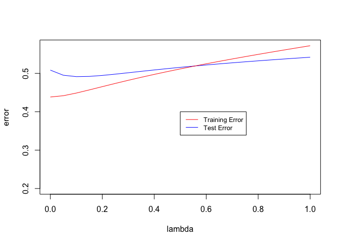
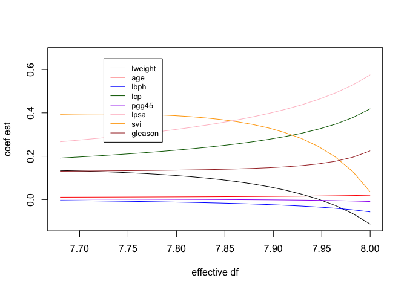

Homework 3
================
Marisa Blackman
2/9/2023

Use the prostate cancer data to :

# Use the cor function to reproduce the correlations listed in HTF Table 3.1, page 50.

``` r
prostate <- 
  read.table(url(
    'https://web.stanford.edu/~hastie/ElemStatLearn/datasets/prostate.data'))
library(tidyverse)
library(glmnet)

mat <- round(cor(prostate[,c('lweight', 'age', 'lbph', 'svi', 'lcp', 'gleason', 'pgg45')], prostate[,c('lcavol', 'lweight', 'age', 'lbph', 'svi', 'lcp', 'gleason')]), 3)

mat[upper.tri(mat)] <- NA

mat
```

    ##         lcavol lweight   age   lbph   svi   lcp gleason
    ## lweight  0.281      NA    NA     NA    NA    NA      NA
    ## age      0.225   0.348    NA     NA    NA    NA      NA
    ## lbph     0.027   0.442 0.350     NA    NA    NA      NA
    ## svi      0.539   0.155 0.118 -0.086    NA    NA      NA
    ## lcp      0.675   0.165 0.128 -0.007 0.673    NA      NA
    ## gleason  0.432   0.057 0.269  0.078 0.320 0.515      NA
    ## pgg45    0.434   0.107 0.276  0.078 0.458 0.632   0.752

# Treat lcavol as the outcome, and use all other variables in the data set as predictors.

``` r
prostate_train <- prostate %>%
  filter(train == TRUE) %>% 
  select(-train)

prostate_test <- prostate %>%
  filter(train == FALSE) %>% 
  select(-train)

x_train <- prostate_train %>%
  select(-lcavol)

x_test  <- prostate_test %>%
  select(-lcavol)
```

# With the training subset of the prostate data, train a least-squares regression model with all predictors using the lm function.

``` r
mod1 <- lm(lcavol ~., data = prostate_train)
summary(mod1)
```

    ## 
    ## Call:
    ## lm(formula = lcavol ~ ., data = prostate_train)
    ## 
    ## Residuals:
    ##      Min       1Q   Median       3Q      Max 
    ## -1.71027 -0.50138  0.03103  0.51352  1.35376 
    ## 
    ## Coefficients:
    ##              Estimate Std. Error t value Pr(>|t|)    
    ## (Intercept) -2.173357   1.526699  -1.424    0.160    
    ## lweight     -0.113370   0.236639  -0.479    0.634    
    ## age          0.020102   0.013571   1.481    0.144    
    ## lbph        -0.056981   0.072525  -0.786    0.435    
    ## svi          0.035116   0.313526   0.112    0.911    
    ## lcp          0.418455   0.099521   4.205 9.16e-05 ***
    ## gleason      0.224387   0.198812   1.129    0.264    
    ## pgg45       -0.009113   0.005451  -1.672    0.100 .  
    ## lpsa         0.575455   0.107235   5.366 1.47e-06 ***
    ## ---
    ## Signif. codes:  0 '***' 0.001 '**' 0.01 '*' 0.05 '.' 0.1 ' ' 1
    ## 
    ## Residual standard error: 0.7116 on 58 degrees of freedom
    ## Multiple R-squared:  0.7118, Adjusted R-squared:  0.672 
    ## F-statistic:  17.9 on 8 and 58 DF,  p-value: 3.999e-13

# Use the testing subset to compute the test error (average squared-error loss) using the fitted least-squares regression model.

``` r
pred <- predict(mod1, newdata=prostate_test)

L2_loss <- function(y, yhat){(y-yhat)^2}

mean(L2_loss(prostate_test$lcavol, pred))
```

    ## [1] 0.5084068

# Train a ridge regression model using the glmnet function, and tune the value of lambda (i.e., use guess and check to find the value of lambda that approximately minimizes the test error).

``` r
form  <- lcavol ~  lweight + age + lbph + lcp + pgg45 + lpsa + svi + gleason
x_inp <- model.matrix(form, data=prostate_train)
y_out <- prostate_train$lcavol

error <- function(dat, fit, lam, form, loss=L2_loss) {
  x_inp <- model.matrix(form, data=dat)
  y_out <- dat$lcavol
  y_hat <- predict(fit, newx=x_inp, s=lam)  ## see predict.elnet
  mean(loss(y_out, y_hat))
}


lambdas <- seq(0,100,by=.05)


test.error <- matrix(NA, ncol=2, nrow = length(lambdas))
coefs <- matrix(NA, ncol = 8, nrow = length(lambdas))
for (i in 1:nrow(test.error)){
  lambda = lambdas[i]
  fit <- glmnet(x=x_inp, y=y_out, lambda=lambda, alpha=0)
  test.error[i, 1] = lambda
  test.error[i,2] = error(prostate_test, fit, lam=0, form=form)
  coefs[i,] <- t(as.matrix(coef(fit))[3:10])
  
}

test.error[which(test.error[,2] == min(test.error[,2])),1]
```

    ## [1] 0.1

Lambda = 0.1 minimized test error.

# Create a figure that shows the training and test error associated with ridge regression as a function of lambda

``` r
#training error 
train.error <- matrix(NA, ncol=2, nrow = length(lambdas))
coefs <- matrix(NA, ncol = 8, nrow = length(lambdas))
for (i in 1:nrow(test.error)){
  lambda = lambdas[i]
  fit <- glmnet(x=x_inp, y=y_out, lambda=lambda, alpha=0)
  train.error[i, 1] = lambda
  train.error[i,2] = error(prostate_train, fit, lam=0, form=form)
  coefs[i,] <- t(as.matrix(coef(fit))[3:10])
  
}

plot(test.error[,1], test.error[,2], ylab = "error", ylim=c(0, max(train.error[,2])))
lines(train.error[,1], train.error[,2])
```

<!-- -->

# Create a path diagram of the ridge regression analysis, similar to HTF Figure 3.8

``` r
names <- c("lweight", "age", "lbph", "lcp", "pgg45", "lpsa", "svi", "gleason")
coefs <- as.data.frame(coefs)
names(coefs) <- names

x_inp <- model.matrix(form, data=prostate_train)
x_inp1 = x_inp[,-1]
D = svd(x_inp1)$d

eff_df <- matrix(NA, ncol = 2, nrow = length(lambdas))
eff_df[,1] <- lambdas

for (j in 1:length(lambdas)){
  eff_df[j,2] = 0
  for (i in 1:length(D)){
    eff_df[j,2] = eff_df[j,2] + (D[i]^2/(D[i]^2 + lambdas[j]))
  }
}

plot(eff_df[,2], coefs[,1], type = 'l', ylim = c(min(coefs), max(coefs)))
lines(eff_df[,2], coefs[,2], type = 'l')
lines(eff_df[,2], coefs[,3], type = 'l')
lines(eff_df[,2], coefs[,4], type = 'l')
lines(eff_df[,2], coefs[,5], type = 'l')
lines(eff_df[,2], coefs[,6], type = 'l')
lines(eff_df[,2], coefs[,7], type = 'l')
lines(eff_df[,2], coefs[,8], type = 'l')
```

<!-- -->
